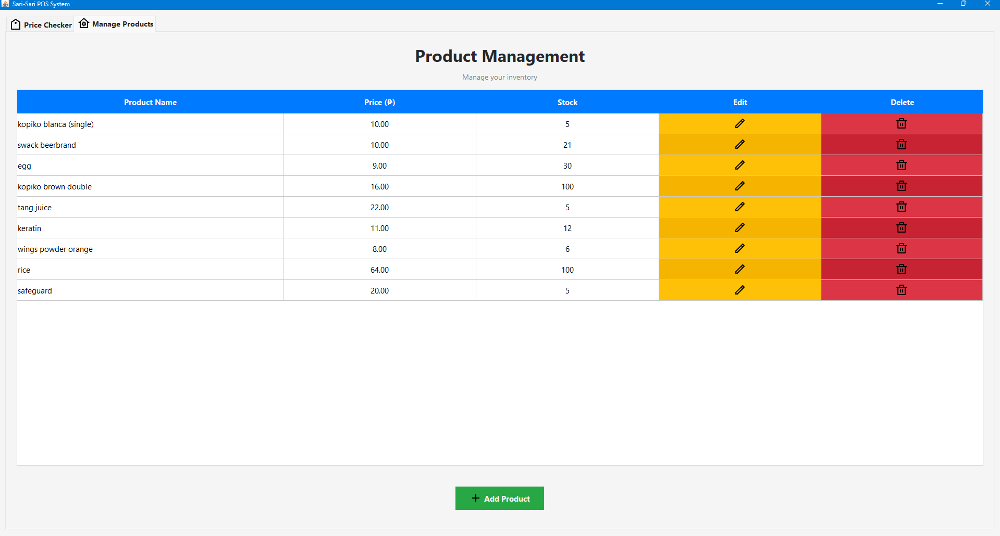
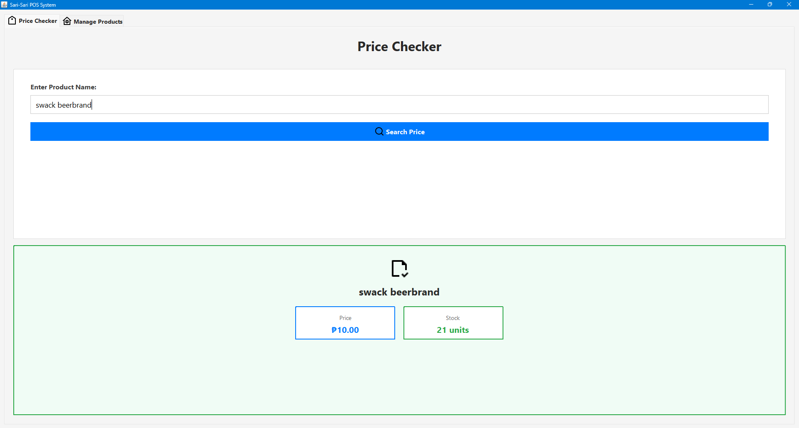

# Sari-Sari POS System

## Overview
The Sari-Sari POS System is a Java-based point-of-sale application designed for small neighborhood stores ("sari-sari stores"). I built this system to solve common challenges in managing inventory, tracking product prices, and keeping stock records manually. This system makes these tasks faster, easier, and more accurate.

## Features
- Add, edit, and delete products directly in the table using intuitive buttons with icons.
- Quickly check product prices using the Price Checker tab with keyword search.
- Track stock levels and product information efficiently.
- Alternating row colors in tables for improved readability.
- Clean and responsive interface for smooth user experience.

## Screenshots

## Installation
1. Clone the repository:
git clone https://github.com/yourusername/sari-sari-pos-system.git

2. Open the project in your favorite IDE (IntelliJ IDEA, Eclipse, etc.).

3. Make sure resources/icons/ contains all required icons (plus.png, edit.png, delete.png, price.png, products.png).

4. Run the Main class (com.sarisari.pos.Main) to start the application.

## Folder Structure
sari-sari-pos-system/
├── src/                     # Java source code
├── resources/icons/         # Icon images for buttons and tabs
├── screenshots/             # Screenshots used in README
├── README.md

## License
This project is open-source. Feel free to fork and modify it.

## Usage Guide (Optional)

Add a Product: Click the green "+" button, fill in the name, price, and stock, and click OK.

Edit a Product: Click the yellow edit icon in the table row, change the price or stock, and click OK.

Delete a Product: Click the red delete icon in the table row to remove the product.

